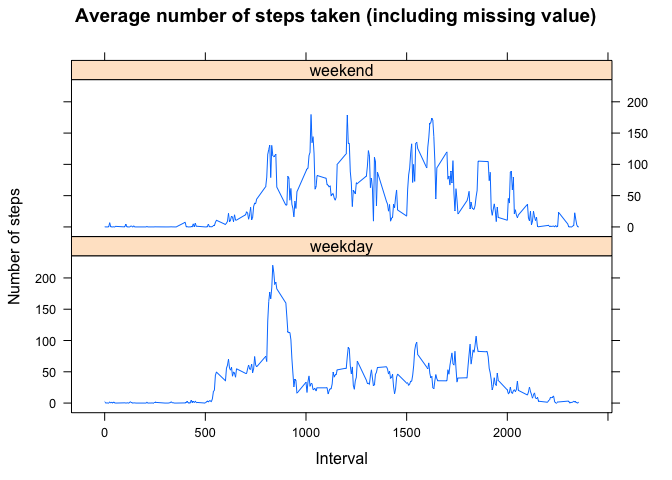

# Reproducible Research: Peer Assessment 1


## Loading and preprocessing the data

1. Load the data (i.e. read.csv())

```r
activity = read.csv('activity.csv')
```

2. Process/transform the data (if necessary) into a format suitable for your
analysis

```r
activity <- transform(activity, date = as.Date(date))
```

## What is mean total number of steps taken per day?

1. Make a histogram of the total number of steps taken each day

```r
sumSteps = aggregate(steps ~ date, activity, sum, na.action=na.omit)
hist(sumSteps$steps, breaks=10, main="Total number of steps taken each day", xlab="Steps", ylab="Count")
```

 

2. Calculate and report the mean and median total number of steps taken per day

```r
mean(sumSteps$steps)
```

```
## [1] 10766.19
```

```r
median(sumSteps$steps)
```

```
## [1] 10765
```

## What is the average daily activity pattern?

1. Make a time series plot (i.e. type = "l") of the 5-minute interval (x-axis) and the average number of steps taken, averaged across all days (y-axis)

```r
meanSteps = aggregate(steps ~ interval, activity, mean, na.action=na.omit)
plot(x = meanSteps$interval, y = meanSteps$steps, type='l', main="Aaverage number of steps taken", xlab="Interval", ylab="Steps")
```

 

2. Which 5-minute interval, on average across all the days in the dataset, contains the maximum number of steps?

```r
meanSteps[which.max(meanSteps$steps),]
```

```
##     interval    steps
## 104      835 206.1698
```

## Imputing missing values

1. Calculate and report the total number of missing values in the dataset
(i.e. the total number of rows with NAs)

```r
length(which(is.na(activity$steps)))
```

```
## [1] 2304
```

2. Devise a strategy for filling in all of the missing values in the dataset. The strategy does not need to be sophisticated.
3. Create a new dataset that is equal to the original dataset but with the missing data filled in.

```r
activity_fill <- activity
for (i in which(is.na(activity_fill$steps))) {
  activity_fill[i, "steps"] <- meanSteps[meanSteps$interval == activity_fill[i, "interval"],"steps"]
}
```

4. Make a histogram of the total number of steps taken each day and Calculate and report the mean and median total number of steps taken per day.

```r
sumSteps_fill = aggregate(steps ~ date, activity_fill, sum)
hist(sumSteps_fill$steps, breaks=10, main="Total number of steps taken each day (including missing value)", xlab="Steps", ylab="Count")
```

 

```r
mean(sumSteps_fill$steps)
```

```
## [1] 10766.19
```

```r
median(sumSteps_fill$steps)
```

```
## [1] 10766.19
```

These values not differ significantly from the estimates from the first part of the assignment.
That is, the impact of imputing missing data is small.

## Are there differences in activity patterns between weekdays and weekends?

1. Create a new factor variable in the dataset with two levels – “weekday” and “weekend” indicating whether a given date is a weekday or weekend day.

```r
activity_fill$weekend_flag <- ifelse(weekdays(activity_fill[,"date"]) == "일요일", "weekend", "weekday")
meanSteps_week = aggregate(steps ~ interval + weekend_flag, activity_fill, mean)
```

2. Make a panel plot containing a time series plot (i.e. type = "l") of the 5-minute interval (x-axis) and the average number of steps taken, averaged across all weekday days or weekend days (y-axis).

```r
library(lattice)
xyplot(steps ~ interval | weekend_flag, meanSteps_week, layout=c(1,2), type="l", main="Average number of steps taken (including missing value)", xlab="Interval", ylab="Number of steps")
```

 
